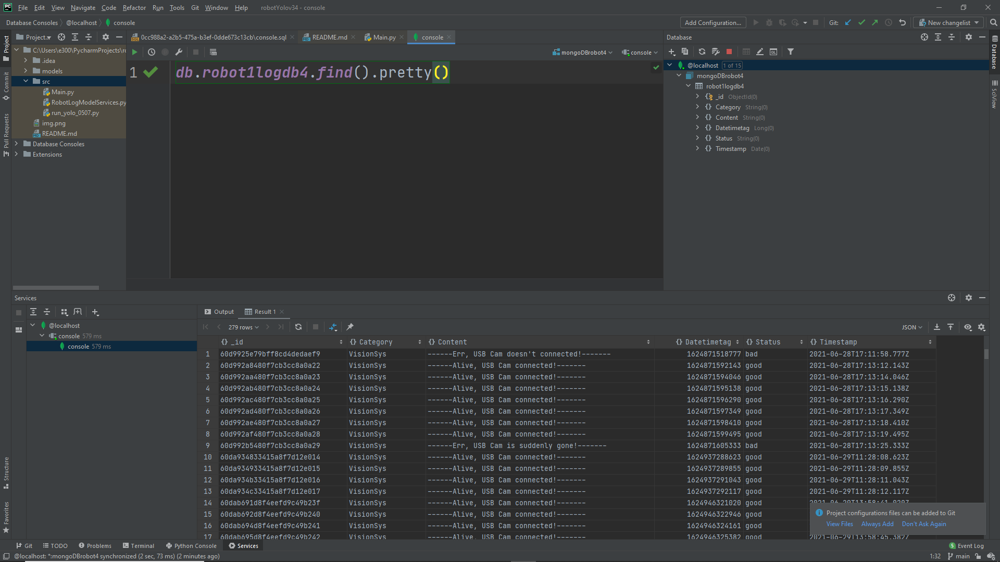
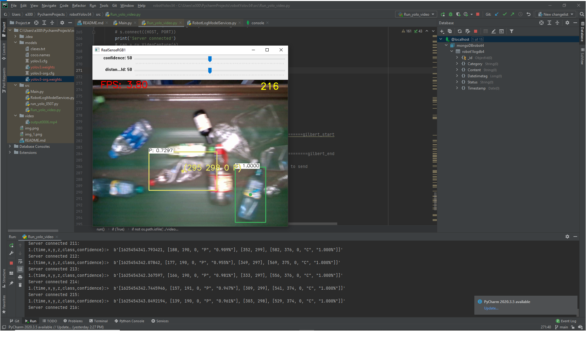
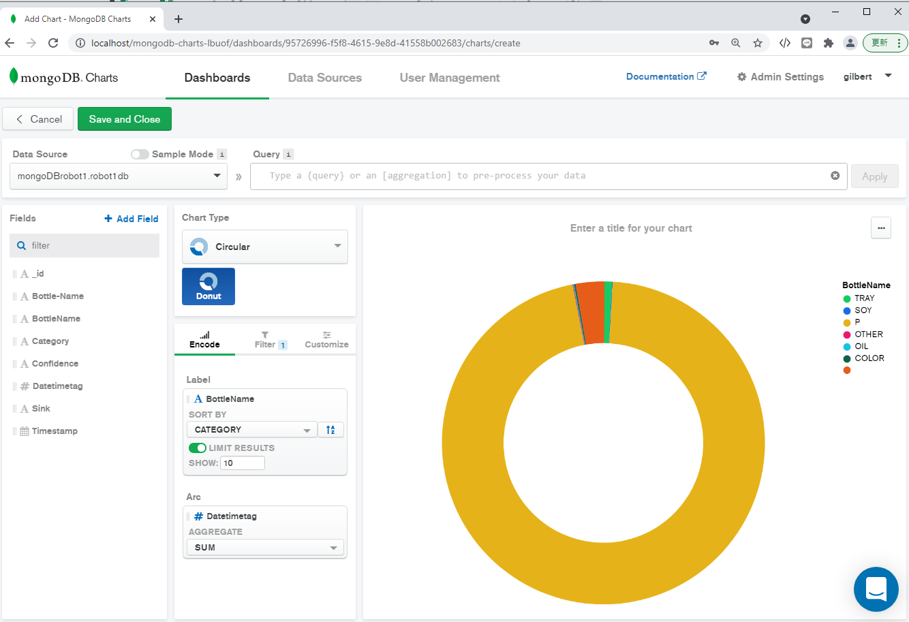
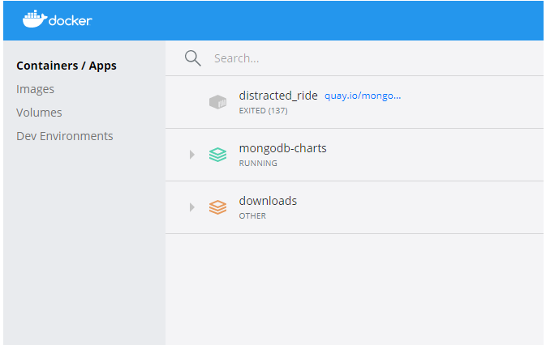

# PET recognized by YOLOv3/v4 with CV2 & MongoDB
This is PET Object detection at Win10

## return value
* return class: P, S, O, C, Ot, CH, T

* return % : class confident percentage

* return right/wrong camera status log at mongoDB

## Realsense Cam & Depth
#### ./Main.py

## MongoDB cmd 

## Play Test video
#### ./Run_yolo_video.py

## MongoDB chart of robot1logdb4/robot1db
#### http://localhost/mongodb-charts/ 

## MongoDB chart Docker container
#### https://segmentfault.com/a/1190000023502067
#### https://docs.atlas.mongodb.com/tutorial/manage-projects/#create-a-project

## 7 Classes model
* CLASSES = ["P", "S", "O", "C", "Ot","CH","T"]

# Environmental requirements
* Opencv 3.2 or laster
* MongoDB 4.0 or later

## Detail
See src/run_yolo_0507.py
